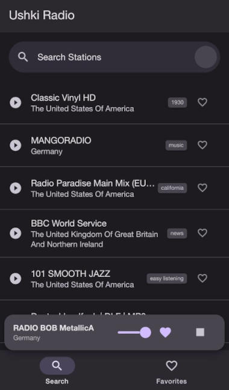
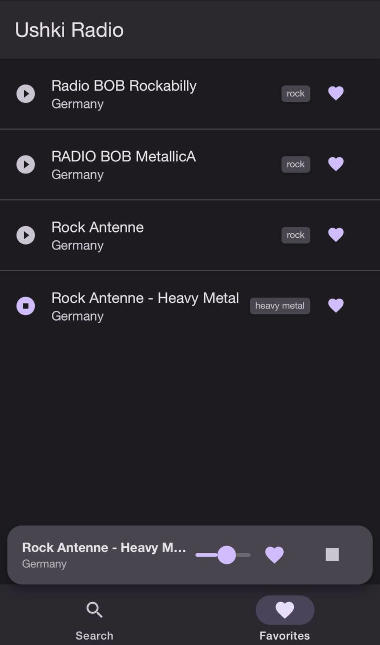

# Ushki Radio




**Ushki Radio** is a lightweight, modern web-based radio player built with Expo and React Native Paper. It allows users to browse, search, and listen to thousands of radio stations from around the world.

## Availability

- **Web Version**: [Available online](https://demensdeum.com/software/ushki-radio)
- **Standalone Versions**: Available at the [releases page](https://github.com/demensdeum/Ushki-Radio/releases) (Native version packed by [Pake](https://github.com/tw93/Pake))


## Features

- **Global Search**: Find stations by name or tags.
- **Top Stations**: Discover popular stations based on community feedback.
- **Favorites**: Save your favorite stations for quick access.
- **Volume Control**: Easy-to-use volume adjustment in the playback bar.
- **Localization**: Automatically detects and supports English and Russian.
- **Persistence**: Remembers your last played station and volume level.
- **Responsive Design**: Works beautifully on web browsers.

## Technology Stack

- **Framework**: [Expo](https://expo.dev/) / React Native
- **UI Library**: [React Native Paper](https://reactnativepaper.com/)
- **Audio Handling**: [expo-av](https://docs.expo.dev/versions/latest/sdk/av/)
- **Localization**: `expo-localization` & `i18n-js`
- **Storage**: `@react-native-async-storage/async-storage`

## Radio List API Service

Ushki Radio utilizes the **[Radio Browser API](https://www.radio-browser.info/)**, a community-driven database of worldwide radio stations.

### Integration Details

The application interacts with the API through the `RadioService.js` component. It uses the following endpoints:

- **Base URL**: `https://de1.api.radio-browser.info/json`
- **Top Stations**: Fetches stations ordered by `clickcount` to show users what's popular.
- **Search**: Queries stations by name with filters to hide broken links and prioritize popular results.

Example implementation in `RadioService.js`:

```javascript
const response = await fetch(`${BASE_URL}/stations/search?name=${query}&order=clickcount&reverse=true&hidebroken=true`);
```

## Running the Project

1. Install dependencies:
   ```bash
   npm install
   ```
2. Start the development server for web:
   ```bash
   npm run web
   ```
3. Export for static hosting:
   ```bash
   npm run build:web
   ```

The build output will be located in the `dist/` directory.

## Troubleshooting

- **Why on first load I get forever load and nothing happens?**
- Your ISP might be blocking access to the [radio-browser.info](https://www.radio-browser.info/) API.

## License

This project is licensed under the 0BSD License.
